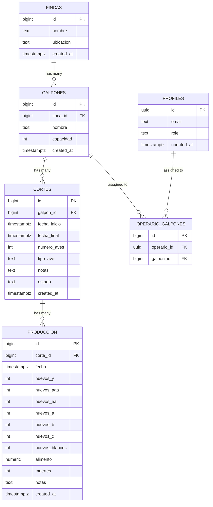

# feat: Admin Dashboard Home with Sidebar Navigation

## Overview

Build the admin dashboard home screen and navigation shell for AviculturaPWA following Brex/Ramp fintech UI patterns. This replaces the current placeholder `HomeScreen` with a layout (sidebar + AppBar + content area) and a dashboard home page with KPI cards, inline alerts, and two charts.

The dashboard serves the **administrador** role with farm-wide visibility across all fincas, galpones, cortes, and production data.

## Problem Statement / Motivation

The current `HomeScreen` at `src/screens/HomeScreen.tsx` is a placeholder with the comment `{/* Aquí irán los dashboards de admin y operario */}`. There is no navigation, no data visualization, and no way for admins to see production status at a glance. The app needs a dashboard shell with sidebar navigation and KPI metrics to be useful for daily farm management.

## Proposed Solution

### 1. Dashboard Layout Shell

Create a `DashboardLayout` component that wraps all authenticated routes:

```
+--------------------------------------------------+
| AppBar (56px, logo + user email + sign out)      |
+--------+-----------------------------------------+
| Sidebar| Main Content Area (<Outlet />)          |
| 260px  | - padded, scrollable, max-width 1400px  |
| (perm) | - renders child route components         |
+--------+-----------------------------------------+
```

- **Desktop (>=900px):** Permanent sidebar (260px). No mini-variant collapse in v1.
- **Mobile (<900px):** Hidden sidebar, hamburger in AppBar opens temporary Drawer overlay
- CSS-based responsive approach (two Drawer instances toggled via `sx.display`)
- AppBar content (app name, user email, sign-out button) is inline within `DashboardLayout` — not a separate component

### 2. Sidebar Navigation

Flat navigation with 7 items (no nesting):

| Item | Icon | Path | Status |
|------|------|------|--------|
| Panel | DashboardOutlined | `/` | Built in this plan |
| Producción | EggOutlined | `/produccion` | Placeholder |
| Galpones | WarehouseOutlined | `/galpones` | Placeholder |
| Cortes | AgricultureOutlined | `/cortes` | Placeholder |
| Fincas | BusinessOutlined | `/fincas` | Placeholder |
| Reportes | AssessmentOutlined | `/reportes` | Placeholder |
| Alertas | NotificationsOutlined | `/alertas` | Placeholder |

Active route highlighted with subtle blue tint background. Hard-coded admin sidebar for now — role-based filtering deferred.

### 3. Dashboard Home Screen

Four KPI cards in a row, inline alert banners, and two charts:

```
+--------+--------+--------+--------+
| Prod.  | Tasa   | Mort.  | FCR    |
| Hoy    | Prod.  | Semanal|        |
+--------+--------+--------+--------+
| [!] Alta mortalidad en Galpón 3   |
+------------------------------------+
+------------------------+----------+
| Producción Diaria      | Clasif.  |
| (30-day area chart)    | Huevos   |
|                        | (donut)  |
+------------------------+----------+
```

- KPI cards include inline trend indicator (colored arrow + %). No separate TrendIndicator component.
- Alerts rendered directly using MUI `<Alert>` — no AlertBanner wrapper component.
- No sparklines in v1. Sparklines deferred until real production data exists.

### 4. Custom Dark Theme (Brex/Ramp Style)

Extract theme to `src/theme.ts` with:
- Near-black backgrounds (`#0B0E11` canvas, `#141820` paper)
- Blue primary accent (`#3B82F6`)
- Semantic colors: green (success), red (error), amber (warning)
- Inter font family
- 12px border radius on cards, `elevation={0}` with subtle borders
- `textTransform: 'none'` on buttons

### 5. Data Layer

- Add `getRole(userId)` method to existing `AuthService.ts` (not a separate ProfileService — it's one method, auth-adjacent)
- New `DashboardService.ts` — aggregated queries for KPIs, chart data, and alert evaluation
- Custom hooks (`useDashboardKpis`, `useProductionChart`, `useDashboardAlerts`) encapsulate loading/error/data lifecycle with AbortController cancellation between services and components

### 6. Auth State

Add `AuthContext` as a discriminated union in `src/AuthContext.tsx` (extracted from App.tsx to satisfy react-refresh lint rule):

```typescript
type AuthState =
  | { status: 'loading' }
  | { status: 'unauthenticated' }
  | { status: 'authenticated'; session: Session; role: UserRole };
```

Expose via `useAuth()` hook exported from `App.tsx`. Consumers never need to null-check `session` and `role` independently.

## Technical Considerations

### Routing Architecture

Stay with declarative `<BrowserRouter>` + `<Routes>`. Add nested routes with a layout route:

```tsx
// src/App.tsx — updated routing structure
<Routes>
  {/* IMPORTANT: Use ternary, not &&, to redirect authenticated users away */}
  <Route path="/login" element={session ? <Navigate to="/" /> : <LoginScreen />} />
  <Route path="/signup" element={session ? <Navigate to="/" /> : <SignUpScreen />} />
  <Route element={session ? <DashboardLayout /> : <Navigate to="/login" />}>
    <Route path="/" element={<DashboardScreen />} />
    <Route path="/produccion" element={<Placeholder title="Producción" />} />
    <Route path="/galpones" element={<Placeholder title="Galpones" />} />
    <Route path="/cortes" element={<Placeholder title="Cortes" />} />
    <Route path="/fincas" element={<Placeholder title="Fincas" />} />
    <Route path="/reportes" element={<Placeholder title="Reportes" />} />
    <Route path="/alertas" element={<Placeholder title="Alertas" />} />
  </Route>
</Routes>
```

`Placeholder` is a 3-line inline component in `App.tsx`, not a separate file.

### KPI Formulas

| KPI | Formula | Time Window |
|-----|---------|-------------|
| **Producción Hoy** | `SUM(huevos_y + huevos_aaa + huevos_aa + huevos_a + huevos_b + huevos_c + huevos_blancos)` for all active cortes | Today |
| **Tasa de Producción** | `(total_huevos_hoy / SUM(numero_aves across active cortes)) * 100` | Today |
| **Mortalidad Semanal** | `SUM(muertes)` across all active cortes | Last 7 days |
| **FCR** | `SUM(alimento) / weighted_egg_mass` using per-classification weights (see below) | Last 7 days |

**FCR egg weight map** (replaces the flawed hardcoded 0.06 kg):

```typescript
const EGG_WEIGHT_KG: Record<string, number> = {
  huevos_y: 0.073,
  huevos_aaa: 0.067,
  huevos_aa: 0.062,
  huevos_a: 0.056,
  huevos_b: 0.049,
  huevos_c: 0.042,
  huevos_blancos: 0.060,
};
```

**Division-by-zero:** FCR returns `null` when denominator is zero. KPI card shows `"--"`.

**Null alimento:** `Produccion.alimento` is nullable in the DB (`NUMERIC` without `NOT NULL`). SUM ignores nulls in Postgres, but if ALL values are null the result is null — handle explicitly.

All date calculations use the browser's local timezone. "Today" = start/end of day computed as ISO strings for Supabase `.gte()` / `.lt()` filtering.

### Alert Thresholds

| Alert | Condition | Severity |
|-------|-----------|----------|
| Alta mortalidad | Per-corte: today's `muertes` > 2x the corte's daily average (min 7 days data) | `error` |
| Baja producción | Overall production rate < 80% | `warning` |
| FCR alto | FCR > 2.5 | `warning` |
| Sin datos hoy | Any active corte with no `produccion` record for today | `info` |

"Low feed inventory" alert **deferred** — requires an `inventario` table that doesn't exist.

### New Dependencies

```bash
npm install @mui/icons-material @mui/x-charts
```

- `@mui/icons-material` — Sidebar and KPI card icons
- `@mui/x-charts` — All charts (AreaChart, PieChart). **Single charting library** — no recharts. MUI X Charts integrates with the MUI theme automatically.

Add Inter font to `index.html`:
```html
<link rel="preconnect" href="https://fonts.googleapis.com" />
<link rel="preconnect" href="https://fonts.gstatic.com" crossorigin />
<link href="https://fonts.googleapis.com/css2?family=Inter:wght@400;500;600;700&display=swap" rel="stylesheet" />
```

### Data Fetching Strategy

Custom hooks per data concern with AbortController cancellation:

```typescript
// Pattern for each hook (useDashboardKpis, useProductionChart, useDashboardAlerts)
function useDashboardKpis() {
  const [state, setState] = useState<{ data: KpiSummary | null; loading: boolean; error: Error | null }>(
    { data: null, loading: true, error: null }
  );

  useEffect(() => {
    const controller = new AbortController();
    DashboardService.fetchKpis(controller.signal)
      .then((data) => setState({ data, loading: false, error: null }))
      .catch((error) => {
        if (!controller.signal.aborted) setState({ data: null, loading: false, error });
      });
    return () => controller.abort();
  }, []);

  return state;
}
```

`DashboardScreen` becomes a thin composition layer calling these hooks. No auto-refresh or Realtime in v1.

### TypeScript Types

Define explicit return types for all service methods and hook states:

```typescript
// src/models/Usuario.ts — extract shared type
export type UserRole = 'administrador' | 'operario';

// Dashboard data interfaces (in DashboardService.ts)
interface KpiSummary {
  readonly todayProduction: number | null;
  readonly productionRate: number | null;
  readonly weeklyMortality: number | null;
  readonly fcr: number | null;
}

interface DailyProductionPoint {
  readonly fecha: string;
  readonly total: number;
}

interface EggClassificationBreakdown {
  readonly classification: string;
  readonly count: number;
}

interface DashboardAlert {
  readonly id: string;
  readonly severity: 'error' | 'warning' | 'info';
  readonly message: string;
}
```

### Model Fix

`Produccion.alimento` must be updated to `number | null` to match the DB schema (no NOT NULL constraint).

### Empty States

- KPI cards: show `"--"` for value, no trend indicator
- Charts: show centered message `"Sin datos de producción disponibles"`
- Alerts: show single info `<Alert>`: `"Bienvenido! Agrega producción diaria para ver métricas."`
- Brand-new account (no fincas): onboarding message in place of KPIs

### Profile Creation

Assumes a Supabase database trigger (`AFTER INSERT ON auth.users`) creates a `profiles` row with `role = 'operario'`. Admins promoted manually. If no profile row exists, default to `'operario'`.

## Acceptance Criteria

### Layout & Navigation
- [x] `DashboardLayout` renders sidebar + AppBar + `<Outlet />` for all authenticated routes
- [x] Sidebar has 7 navigation items with Material icons, active item highlighted
- [x] Sidebar is permanent on desktop (260px), temporary Drawer on mobile (<900px)
- [x] AppBar shows app name and user email with sign-out action
- [x] All navigation links update the URL and render the correct screen

### Theme & Styling
- [x] Custom dark theme extracted to `src/theme.ts` with Brex/Ramp palette
- [x] Inter font loaded and applied
- [x] Cards use `elevation={0}` with subtle borders, 12px border radius
- [x] No uppercase text on buttons

### Dashboard KPIs
- [x] 4 KPI cards in a responsive grid (4 cols desktop, 2 cols tablet, 1 col mobile)
- [x] Each card shows: label, formatted value with unit, inline trend % with colored indicator
- [x] Numbers formatted with `toLocaleString('es-CO')`
- [x] FCR uses per-classification egg weights, handles division by zero

### Alerts
- [x] Alert banners render inline at top of dashboard using MUI `<Alert>`, sorted by severity
- [ ] Alerts are dismissible (per-session, not persisted)
- [x] High mortality, low production, high FCR, and missing-data alerts implemented

### Charts
- [x] 30-day production trend area chart (MUI X Charts `LineChart` with `area`)
- [x] Egg classification donut chart (MUI X Charts `PieChart` with `innerRadius`)
- [x] Charts inherit dark theme colors automatically

### Data Layer
- [x] `getRole()` method added to `AuthService.ts`
- [x] `DashboardService.ts` provides methods for KPI data, chart data, and alert evaluation
- [x] Custom hooks (`useDashboardKpis`, `useProductionChart`, `useDashboardAlerts`) with AbortController
- [x] `AuthContext` with discriminated union provides `useAuth()` hook
- [x] All service methods have explicit TypeScript return types

### Empty & Error States
- [x] KPI cards show `"--"` when no data available
- [x] Charts show `"Sin datos"` empty state
- [ ] Individual component errors don't crash the full dashboard
- [ ] New accounts with no fincas see an onboarding message

### Existing Functionality
- [x] Login, signup, and session management continue to work unchanged
- [x] Auth redirects use ternary pattern (not `&&`) to properly redirect authenticated users

### Model Fixes
- [x] `Produccion.alimento` type updated to `number | null`
- [x] `UserRole` type extracted from `Usuario.ts` for shared use

## Success Metrics

- Admin can see at-a-glance production status within 3 seconds of login
- Dashboard loads all KPIs and charts without requiring navigation
- Sidebar enables navigation to all major sections (even if placeholder)
- Mobile users can access the full dashboard with responsive layout

## Dependencies & Risks

| Dependency | Risk | Mitigation |
|------------|------|------------|
| `profiles` table must exist with role data | Role fetching fails if no rows | Default to `'operario'`; document DB trigger needed |
| `@mui/icons-material` adds ~20KB | Minimal | Named imports for tree-shaking |
| `@mui/x-charts` adds ~30KB | Acceptable | Single charting library for all charts |
| Supabase RLS must be configured | Without RLS, data leaks | Verify policies from `database_schema.md` are applied |
| No test framework | Cannot write automated tests | Manual testing; test setup out of scope |
| Multi-finca aggregation | Slow on large datasets | Aggregates all fincas; add finca filter as fast-follow |

## File Structure

**8 new/modified files** (down from 15 in original plan):

```
src/
  theme.ts                          # NEW — Brex/Ramp dark theme
  components/
    DashboardLayout.tsx             # NEW — sidebar + inline AppBar + Outlet shell
    Sidebar.tsx                     # NEW — navigation drawer content
    KpiCard.tsx                     # NEW — metric card with inline trend
    ProductionChart.tsx             # NEW — 30-day area chart (@mui/x-charts)
    EggClassificationChart.tsx      # NEW — donut chart (@mui/x-charts)
  screens/
    DashboardScreen.tsx             # NEW — dashboard home (replaces HomeScreen)
  services/
    AuthService.ts                  # MODIFIED — add getRole() method
    DashboardService.ts             # NEW — KPI, chart, alert queries + hooks
  models/
    Usuario.ts                      # MODIFIED — extract UserRole type
    Produccion.ts                   # MODIFIED — alimento: number | null
  App.tsx                           # MODIFIED — AuthContext, nested routes, inline Placeholder
index.html                          # MODIFIED — add Inter font link
```

**Eliminated from original plan:**
- `TrendIndicator.tsx` — inlined in KpiCard
- `AlertBanner.tsx` — use MUI `<Alert>` directly
- `PlaceholderScreen.tsx` — inline 3-line component in App.tsx
- `AppHeader.tsx` — inline in DashboardLayout
- `OperarioGalpon.ts` — YAGNI, operario features deferred
- `ProfileService.ts` — merged into AuthService
- `AuthContext.tsx` — defined in App.tsx
- `contexts/` directory — unnecessary
- `recharts` dependency — using `@mui/x-charts` exclusively

## Deferred to Future Iterations

| Feature | Why Deferred |
|---------|-------------|
| Sparklines in KPI cards | Need historical data to be meaningful |
| Mini-variant sidebar collapse | Cosmetic polish, adds state/animation complexity |
| Operario role-based sidebar filtering | Operario views not built yet |
| Route-level role guards | Only admin matters right now |
| Low feed inventory alert | Requires new `inventario` table |
| Supabase Realtime / auto-refresh | Manual data entry first, real-time later |
| `createBrowserRouter` migration | Current `<Routes>` works; migrate when loaders needed |

## References & Research

### Internal References
- Current routing: `src/App.tsx:59-66`
- Current theme: `src/App.tsx:12-16`
- HomeScreen placeholder: `src/screens/HomeScreen.tsx:13`
- Auth service pattern: `src/services/AuthService.ts`
- Supabase client: `src/services/supabaseClient.ts`
- Data models: `src/models/` (Finca, Galpon, Corte, Produccion, Usuario)
- Database schema + RLS: `database_schema.md`

### External References
- [MUI Drawer (responsive pattern)](https://mui.com/material-ui/react-drawer/)
- [MUI Grid v2 (size prop API)](https://mui.com/material-ui/react-grid/)
- [MUI X Charts (AreaChart, PieChart)](https://mui.com/x/react-charts/)
- [MUI Dark Mode theming](https://mui.com/material-ui/customization/dark-mode/)
- [React Router v7 nested routes / Outlet](https://reactrouter.com/start/data/routing)
- [Brex design system](https://the-brandidentity.com/project/studio-freights-intimate-knowledge-of-brex-drives-its-smart-rebrand)
- [Poultry farm KPIs](https://www.modeliks.com/industries/agriculture/poultry-farm-kpis-dashboard)

### ERD (Existing Data Model)


